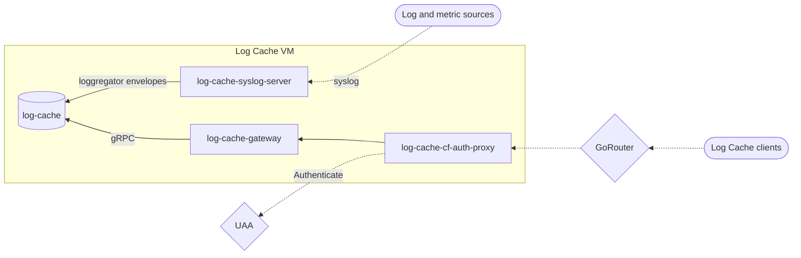

# Log Cache Release

A BOSH release providing an in-memory caching layer for logs and metrics emitted by [Cloud Foundry] applications and system components.

## Deployment

Log Cache is built for [Cloud Foundry] and is not intended for use outside of [Cloud Foundry] deployments, like [cf-deployment].

It is meant to be deployed as a collection of microservices on a node within [Cloud Foundry]. Log Cache nodes are horizontally scalable, and source IDs (e.g. application GUID, unique string, etc) of envelopes are hashed to determine which Log Cache node will host which envelopes. Envelopes can be sent to any Log Cache node and they will be forwarded on to the correct node. Similarly, Log Cache clients can reach out to any Log Cache node for logs or metrics, and will be forwarded to the appropriate node for the source ID they are requesting.

Within [cf-deployment], Log Cache interacts with a number of other components by default:
* Log Cache receives data from Syslog Agents, which are added on to every VM.
* Cloud Controller queries Log Cache for app instance metrics such as CPU usage and memory when retrieving details for applications.
* The cf CLi queries Log Cache directly to retrieve recent logs for applications.

### Jobs

* **log-cache ([spec](jobs/log-cache/spec)) ([main.go](src/cmd/log-cache/main.go))**: stores the logs and metrics.
* **log-cache-cf-auth-proxy (spec) (main.go)**: authenticates and proxies requests from Log Cache clients.
* **log-cache-gateway (spec) (main.go)**: authenticates and proxies requests from Log Cache clients.
* **log-cache-syslog-server (spec) (main.go)**: authenticates and proxies requests from Log Cache clients.

### Configuration

#### Scaling

Numerous variables affect the retention of Log Cache:

Number of instances - Increasing adds more storage space, allows higher throughput and reduces contention between sources

Max Per Source ID - Increasing allows a higher max storage allowance, but may decrease the storage of less noisy apps on the same node

Memory per instance - Increasing allows more storage in general, but any given instance may not be able to take advantage of that increase due to max per source id

Memory limit - Increasing memory limit allows for more storage, but may cause out of memory errors and crashing if set too high for the total throughput of the system

Larger CPUs - Increasing the CPU budget per instance should allow higher throughput

Log Cache is known to exceed memory limits under high throughput/stress. If you see your log-cache reaching higher memory
then you have set, you might want to scale your log-cache up. Either solely in terms of CPU per instance, or more instances.

You can monitor the performance of log cache per source id (app or platform component) using the Log Cache CLI. The command `cf log-meta` allows viewing
the amount of logs and metrics as well as the period of time for those logs and metrics for each source on the system. This can be used in conjunction with scaling
to target your use cases. For simple pushes, a low retention period may be adequate. For running analysis on metrics for debugging and scaling, higher retention
periods may be desired; although one should remember all logs and metrics will always be lost upon crashes or re-deploys of log-cache.

#### Log Cache Syslog Server TLS and mutual TLS configuration

If someone runs Cloud Foundry with a hardened setup in terms of security, they might want to activate TLS or even mutual TLS(mTLS) for the incoming connections to the Log Cache Syslog Server. The activation of TLS and mTLS is optional and is configured by the presence of the needed certificates. For TLS a syslog certificate or syslog key should be present in the BPM configuration and for mTLS a syslog client CA certificate should be present in the BPM configuration. Check the BOSH [BPM template](jobs/log-cache-syslog-server/templates/bpm.yml.erb) and the [spec](jobs/log-cache-syslog-server/spec) for details.

#### Reliability

Log Cache is an in memory cache and as such will drop envelopes when it restarts. Users should not expect 100% availability of
logs in Log Cache and should plan accordingly. For example, Cloud Controller can function without Log Cache though users are
informed that Log Cache is unavailable.

### Diagram

## How do I use it?

### From the `cf` CLI

Application developers using Cloud Foundry will use Log Cache automatically. Build logs while running
`cf push` are streamed through Log Cache. Application logs when running `cf logs` are retrieved from Log Cache.
Application metrics when running `cf app APP_NAME` are retrieved from Log Cache.

### Using the Log Cache CLI plugin
To query Log Cache directly users or operators can install the [Log Cache CLI plugin](https://github.com/cloudfoundry/log-cache-cli)
by running `cf install-plugin -r CF-Community "log-cache"` which provides additional commands in the CLI for querying logs and metrics
stored in log cache. This is useful for querying system component metrics which are not exposed otherwise. See the CLI plugin README for details. 

### Log Cache API
Documentation about the internals of Log Cache and its API can be found [here](https://github.com/cloudfoundry/log-cache-release/blob/main/src/README.md)

[Cloud Foundry]: https://www.cloudfoundry.org/
[cf-deployment]: https://github.com/cloudfoundry/cf-deployment