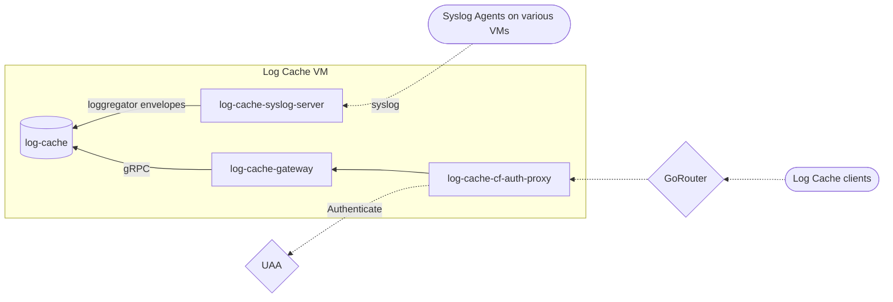

# Architecture

## Source IDs

Log Cache indexes data by the `source_id` field on the [Loggregator Envelope]. Source IDs should be unique across Cloud Foundry applications and system components.

> [!IMPORTANT]  
> Application instances should all share the same source ID.

Typically, the source ID of a Cloud Foundry application is its GUID, and the source ID of a Cloud Foundry system component is its name (e.g. `doppler`).

## Envelope sharding

Log Cache is built to be horizontally scalable by sharding source IDs accross nodes. The source IDs are hashed to determine which Log Cache node will host which envelopes. Envelopes can be sent to any Log Cache node and they will be forwarded on to the correct node. Similarly, Log Cache clients can reach out to any Log Cache node for logs or metrics, and will be forwarded to the appropriate node for the source ID they are requesting.

## API

Log Cache's API contains three different sets of endpoints:
* `read` and `meta` are source ID-oriented.
* `query` and `query_range` are metric-oriented, and fulfill the Prometheus API.
* `info` for service version discoverability.

### Authentication

Each request must be via HTTPS and have the `Authorization` header set with a UAA-provided token.

The token must have one of the following:
* `doppler.firehose` scope.
* `logs.admin` scope.
* A relevant Cloud Controller role.

Having one of those two scopes is sufficient to return data for any source ID.

> [!IMPORTANT]
> Either the `doppler.firehose` scope or the `logs.admin` scope is required in order to retrieve system component metrics from Log Cache.

> [!WARNING]
> These authentication requirements can be bypassed completely by querying the log-cache job directly via gRPC with the correct certificates for mTLS authentication.

## Clients

Log Cache clients should use the [Go Client Library for Log Cache](https://github.com/cloudfoundry/go-log-cache) to communicate with Log Cache. Here are some useful links within that library:
* [Protobuf definitions](https://github.com/cloudfoundry/go-log-cache/tree/main/api/v1)
* [Go generated code](https://github.com/cloudfoundry/go-log-cache/tree/main/rpc/logcache_v1)
* [Examples](https://github.com/cloudfoundry/go-log-cache/tree/main/examples)

---

#### Vertical Scaling

Operators should be mindful of the amount of memory they provide to Log Cache, as 

Log Cache only needs sufficient CPU to accept incoming logs and metrics.

#### Log Cache Syslog Server TLS and mutual TLS configuration

If someone runs Cloud Foundry with a hardened setup in terms of security, they might want to activate TLS or even mutual TLS(mTLS) for the incoming connections to the Log Cache Syslog Server. The activation of TLS and mTLS is optional and is configured by the presence of the needed certificates. For TLS a syslog certificate or syslog key should be present in the BPM configuration and for mTLS a syslog client CA certificate should be present in the BPM configuration. Check the BOSH [BPM template](jobs/log-cache-syslog-server/templates/bpm.yml.erb) and the [spec](jobs/log-cache-syslog-server/spec) for details.

### Log Cache API
Documentation about the internals of Log Cache and its API can be found [here](https://github.com/cloudfoundry/log-cache-release/blob/main/src/README.md)

It is meant to be deployed as a collection of microservices on a node within [Cloud Foundry]. Log Cache nodes are horizontally scalable, and source IDs (e.g. application GUID, unique string, etc) of envelopes are hashed to determine which Log Cache node will host which envelopes. Envelopes can be sent to any Log Cache node and they will be forwarded on to the correct node. Similarly, Log Cache clients can reach out to any Log Cache node for logs or metrics, and will be forwarded to the appropriate node for the source ID they are requesting.

Within [cf-deployment], Log Cache interacts with a number of other components by default:
* Log Cache receives data from Syslog Agents, which are added on to every VM.
* Cloud Controller queries Log Cache for app instance metrics such as CPU usage and memory when retrieving details for applications.
* The cf CLi queries Log Cache directly to retrieve recent logs for applications.

[Cloud Foundry]: https://www.cloudfoundry.org/
[gRPC]: https://grpc.io/
[Loggregator Envelope]: https://github.com/cloudfoundry/loggregator-api/blob/master/v2/envelope.proto
